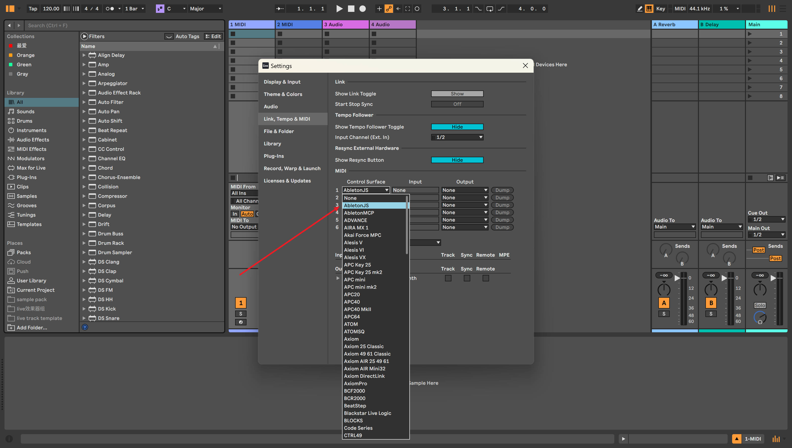

# ableton-copilot-mcp

<div align="center">
  
  
  
  
</div>

> An MCP (Model Context Protocol) server built on [ableton-js](https://github.com/leolabs/ableton-js) for real-time interaction and control with Ableton Live's Arrangement View, dedicated to assisting music producers in their music production.

## 🎯 Note

As a music producer, I have some understanding of using Ableton for music creation. During the creative process, we often need to handle various tedious operations, such as humanizing note properties, merging notes, recording one track to another audio track, etc. Previously, we could only rely on the functions provided by the host DAW for these operations. However, with the emergence of large language models and MCP, we now have the possibility to let AI help us with automation. Although it's still not realistic for AI to directly generate notes or create a complete song (it can't generate a good-sounding song), having AI assist us with auxiliary operations presents a new possibility.

## 🚀 Features

### 🎵 Song Control
- Get basic song information (root note, scale name, tempo, song length, etc.)
- Get a list of all tracks
- Create MIDI, audio, and return tracks
- Delete and duplicate tracks

### 🎹 Track Management
- Get all clips in a track
- Create empty MIDI clips in the arrangement view tracks
- Create audio clips in tracks based on provided sample file paths
- Set track properties (mute, color, name, arm, solo, etc.)
- Duplicate MIDI clips to specified tracks

### 🎼 Clip Operations
- Get clips in the piano roll view
- Get and manage all notes in a clip
- Add, delete, and replace notes in clips
- Set clip properties (name, color, looping, loop_start, loop_end, etc.)

### 🎧 Audio Operations
- Supports recording track content based on time range

### 🔌 Device Management
- Load audio effects, instruments and plugins
- Modify device parameters
- Browse available devices in the library

### 📝 State Management
- Operation history tracking and detailed logging
- Snapshot creation for critical operations
- Support for operation rollback (especially for note operations)
- Browse and restore previous states

## 📝 To-Do List
- Allow returning the created clip_id when creating midi clips (pending ableton-js update)
- Support automatic envelope adjustment
- Support more snapshot types (track properties, device parameters, etc.)

## ⚠️ Warning
- Direct manipulation of MIDI clips by AI may result in the loss of original notes and cannot be undone with Ctrl + Z. Please operate with caution. If needed, you can ask the AI to help you roll back note operations.
## 📥 Installation

### Prerequisites
- **Node.js** environment: Ensure Node.js is installed (v20+ recommended) and the `npx` command is available
  > 🔗 Download: [Node.js official website](https://nodejs.org/)

### Installation Steps

#### 1. Install AbletonJS MIDI Remote Scripts

Choose **ONE** of the following three methods to install MIDI Remote Scripts:

- **Method 1: One-line installation (Recommended)**  
  ```bash
  npx @xiaolaa2/ableton-copilot-mcp --install-scripts
  # or use the short form
  npx @xiaolaa2/ableton-copilot-mcp -is
  ```

- **Method 2: Tool-assisted installation**  
  1. First, start ableton-copilot-mcp (see Usage section below)
  2. Let AI assistant or manually call the MCP tool `init_ableton_js` to complete the installation automatically
   
- **Method 3: Manual installation**  
  1. Create a folder named "Remote Scripts" in your Ableton User Library:
     - Windows: `C:\Users\[username]\Documents\Ableton\User Library\Remote Scripts`
     - Mac: `/Users/[username]/Music/Ableton/User Library\Remote Scripts`
  2. Download MIDI Remote Scripts from the [ableton-js](https://github.com/leolabs/ableton-js) project
  3. Copy the downloaded `midi-script` folder to the location above
  4. Rename it to `AbletonJS`

## 🔧 Usage

### Quick Start

1. **Launch Ableton Live**

2. **Enable AbletonJS Control Surface**
   - Open Ableton Live Preferences: `Preferences` → `Link/MIDI`
   - In the `MIDI` tab, locate the `Control Surface` section
   - Select `AbletonJS` from the dropdown menu

   <div align="center">
     
     <p><em>Figure 1: Enabling AbletonJS Control Surface in Ableton Live Configuration</em></p>
   </div>

3. **Connect using an MCP client**
   
   The following clients can be used as MCP endpoints:
   - [Cursor](https://www.cursor.com)
   - [Cherry Studio](https://github.com/CherryHQ/cherry-studio)
   - Claude Desktop
   - Other MCP clients

### Client Configuration

#### Cursor Configuration Example

Add the following configuration to your Cursor settings:

```json
"ableton-js-mcp": {
    "command": "npx",
    "args": [
        "-y",
        "@xiaolaa2/ableton-copilot-mcp"
    ]
}
```

For the latest version:

```json
"ableton-js-mcp": {
    "command": "npx",
    "args": [
        "-y",
        "@xiaolaa2/ableton-copilot-mcp@latest"
    ]
}
```

#### Custom Storage Path (Optional)

You can specify a custom data storage location using the `BASE_PATH` environment variable:

```json
"ableton-js-mcp": {
    "command": "npx",
    "args": [
        "-y",
        "@xiaolaa2/ableton-copilot-mcp"
    ],
    "env": {
        "BASE_PATH": "D:\\ableton_copilot_mcp"
    }
}
```

> 💡 **Tip**: The storage path is used to save log files, operation history, and state snapshots

### Usage Tips

- When connecting for the first time, it may take a few seconds to establish communication with Ableton Live
- Make sure Ableton Live is running and the AbletonJS Control Surface is properly loaded
- To check the connection status, you can use the `get_song_status` command in the MCP tools

## ✅ Compatibility Testing

Compatibility primarily depends on the version support of the [ableton-js](https://github.com/leolabs/ableton-js) library.

| Ableton Live Version | Test Status |
| -------------------- | ----------- |
| 12.1.10              | ✅ Tested and working |
| 11.x                 | ⚠️ Not tested yet |
| 10.x                 | ⚠️ Not tested yet |

## 🤝 Contributing

Issues and contributions are welcome. Please submit issues or suggestions through [GitHub Issues](https://github.com/xiaolaa2/ableton-copilot-mcp/issues).

## 📄 License

This project is licensed under the [MIT License](./LICENSE).

## ⚠️ Disclaimer
This is a third-party integration and not made by Ableton.